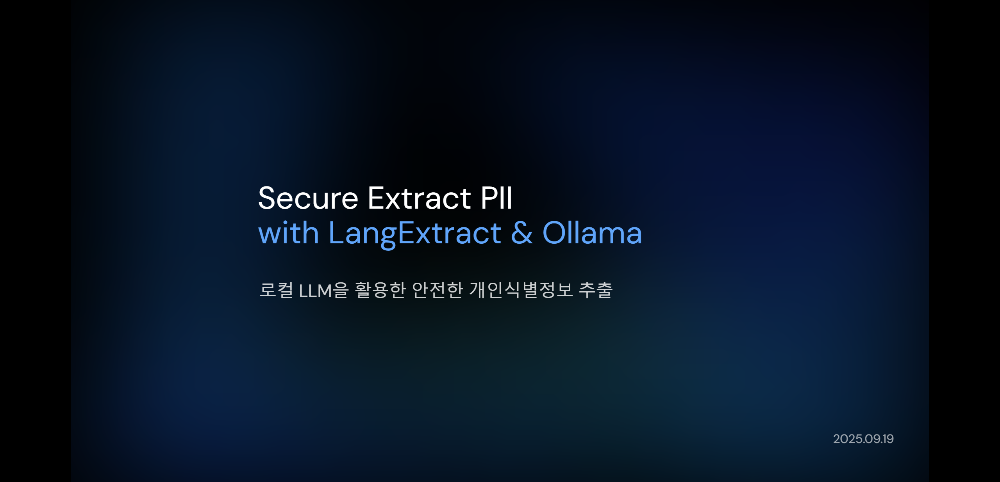

# Extract PII Project Slides

`Extract PII Project` 는 PII(Personally Identifiable Information, 개인 식별 정보)를 LangExtract 과 Ollama 를 사용하여 추출하는 프로젝트입니다.

## 프레젠테이션

|   |   |
|---|---|
|  | 2025.09.19 @ LSware |
| Extract PII PoC [Draft](./packages/extract-pii-poc/samples/draft.md) | [Slides](https://huketo.github.io/extract-pii-slides/extract-pii-poc/#/1) |
