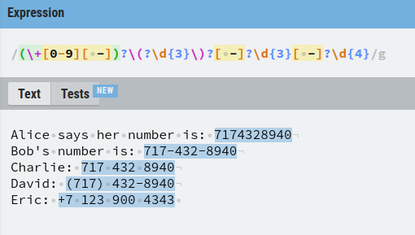
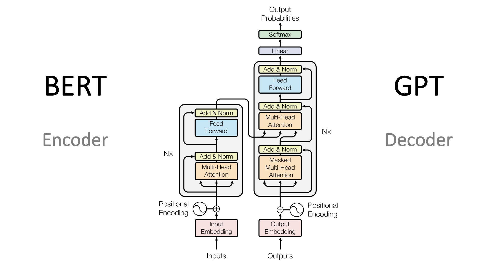
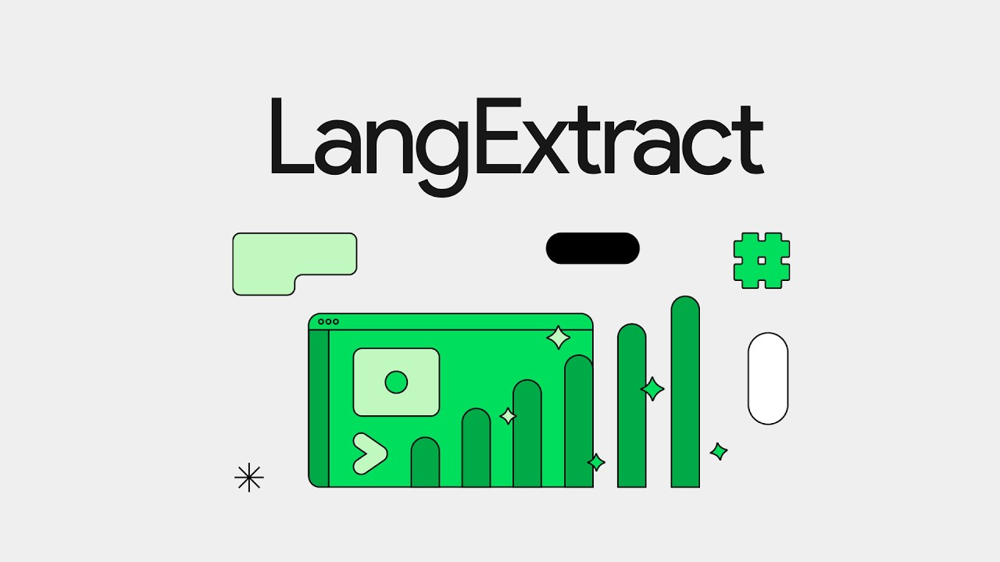
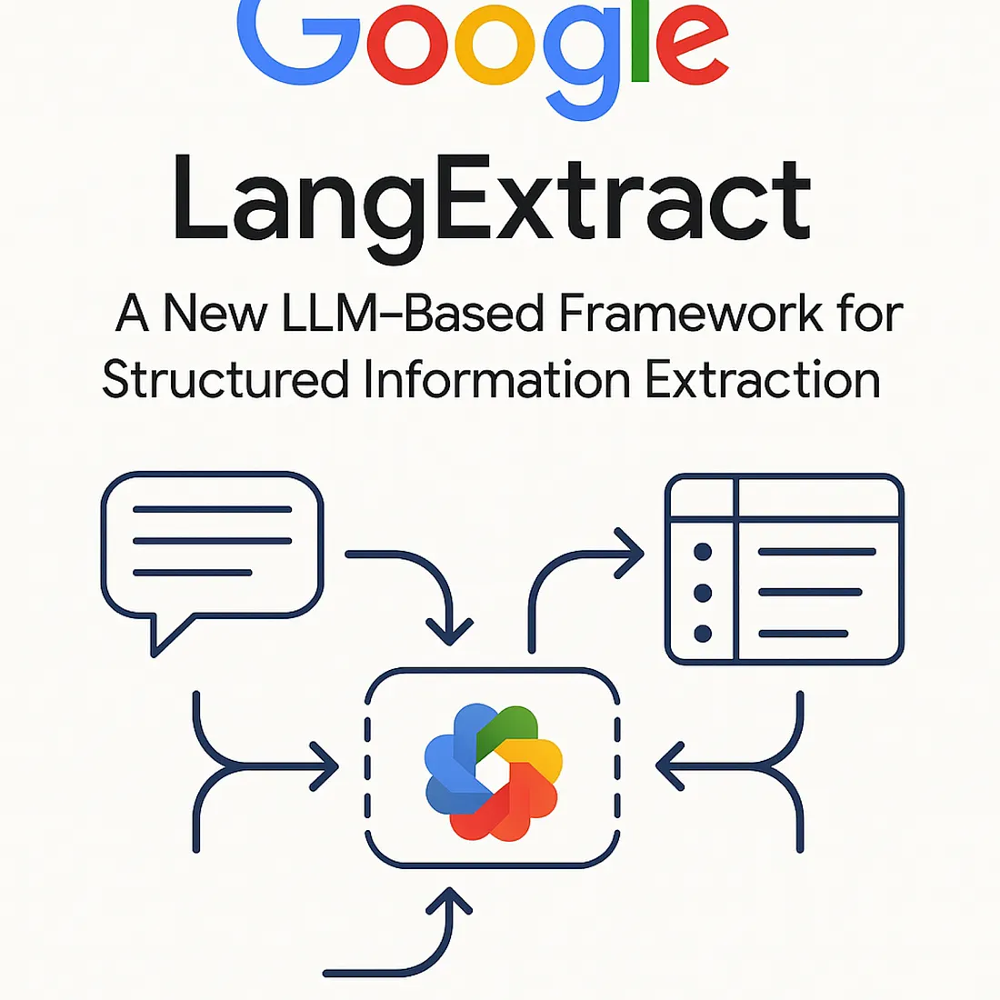
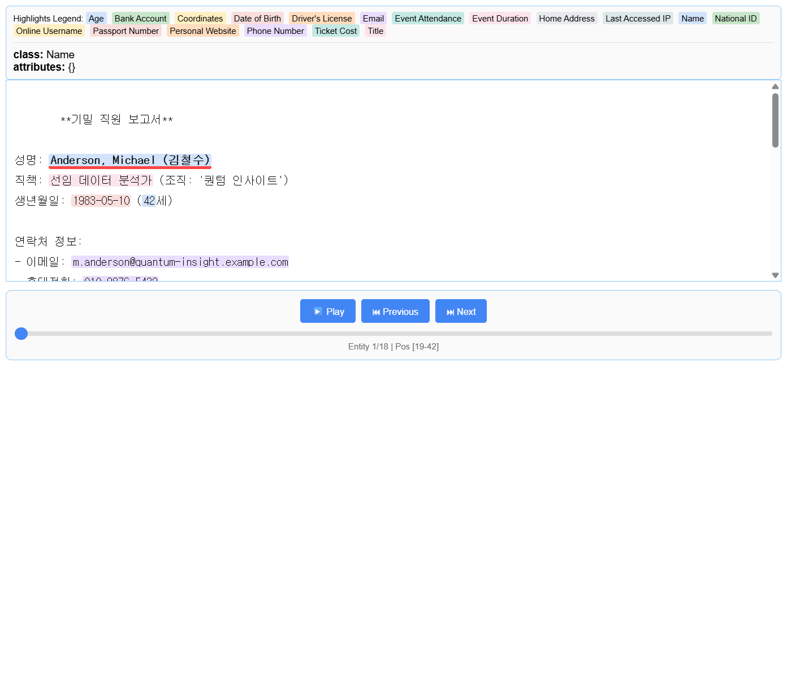

# Extract PII PoC (with LangExtract)

## 개요

2025년 7월에 공개된 Google의 [LangExtract](https://github.com/google/langextract) 라는 LLM을 활용한 데이터추출 라이브러리를 사용해서 로컬에서 Ollama를 실행하여 외부 LLM 서비스에 보내기 민감한 PII(개인식별정보) 를 추출하는 PoC 를 간단하게 실험해보았습니다.

## 배경

### 데이터 추출 기술의 변화

#### 1. 전통적인 방법 (정규 표현식 및 규칙 기반)



초기에는 정규 표현식(Regular Expression)이나 규칙 기반 접근 방식을 사용하여 텍스트에서 특정 정보를 추출했습니다. 이러한 방법은 특정 패턴에는 효과적이었지만, 유지 관리가 어렵고 새로운 유형의 PII(개인 식별 정보)를 식별하는 데 한계가 있었습니다. 또한, 다양한 NLP(자연어 처리) 작업을 위해 고유한 아키텍처를 만들어야 했습니다

#### 2. 머신러닝 모델 (BERT 등장)


2018년 말에 BERT(Bidirectional Encoder Representations from Transformers)와 같은 인코더 전용(Encoder-Only) 모델이 등장하면서 이러한 작업에 활용되기 시작했습니다. BERT 모델은 특정 NLP 작업(예: 감성 분석, 텍스트 분류, 개체명 추출)에 맞춰 미세 조정(fine-tuning)하기 매우 유용했습니다. 한때는 프로덕션 환경에서 이름, 개체, 감성 분석, 텍스트 분류와 같은 작업을 수행하는 데 매우 효과적이었으며, 이전의 LSTM과 같은 모델에 비해 컨텍스트 창이 512 토큰으로 훨씬 커졌습니다.

#### 3. LLM (대규모 언어 모델)의 부상



최근에는 GPT와 같은 트랜스포머(Transformer) 기반의 인코더-디코더(Encoder-Decoder) 모델이 급격하게 발전했습니다. 이러한 LLM은 데이터 라벨링이나 모델 훈련에 대한 의존도를 줄이고, 프롬프트 엔지니어링을 통해 PII 추출과 같은 복잡한 NLP 작업을 수행하는 방식으로 주목받고 있습니다. 불과 지난 6개월 동안 많은 대기업들이 기존의 BERT 모델 대신 GPT-4o Mini나 Gemini Flash와 같은 LLM을 활용하여 동일한 결과를 얻고 있으며, 오히려 LLM API를 서비스 형태로 사용하는 것이 더 저렴하고 효율적이라는 인식이 확산되고 있습니다.

### LangExtract의 등장



LangExtract는 이러한 데이터 추출 기술의 변화, 특히 **LLM의 발전과 기존 방식의 한계** 속에서 등장했습니다.

- **비정형 텍스트 속 인사이트 추출의 어려움**: 오늘날 넘쳐나는 데이터 속에서 임상 기록, 법률 문서, 고객 피드백, 뉴스 보도 등 **비정형 텍스트에 귀중한 인사이트**가 묻혀 있는 경우가 많습니다. 이러한 정보를 수동으로 선별하거나 맞춤형 코드를 작성하는 것은 시간이 오래 걸리고 오류가 발생하기 쉽습니다.
- **LLM의 직접적인 활용 시 문제점**: 최신 LLM을 무턱대고 사용하면 오류가 발생할 수 있으며, 특히 추출된 정보가 원본 텍스트에 정확하게 근거하는지(**source grounding**) 확인하기 어렵다는 문제가 있습니다. LLM은 뛰어난 성능을 보이지만, "건초더미에서 바늘 찾기"와 같이 백만 토큰 수준의 긴 컨텍스트에서는 재현율이 감소할 수 있습니다.
- **정확하고 구조화된 추출의 필요성**: 개발자들은 필요한 정확한 정보를 프로그래밍 방식으로 추출하고, 그 결과물이 **구조화되어 있으며 소스에 안정적으로 연결될 수 있는 도구**를 필요로 했습니다.
- **LLM의 강점 활용**: LLM은 광범위한 세계 지식을 가지고 있으며, 몇 가지 예시만으로도 다양한 도메인의 정보 추출 작업을 학습할 수 있는 유연성을 제공합니다.

## 목표 (Secure Extract PII)


> Secure Extract PII: 민감한 데이터를 외부 서비스에 보내지 않고도 로컬에서 안전하게 개인 식별 정보를 추출하는 방법을 탐구합니다.

오늘날 기업과 기관은 임상 기록, 법률 문서, 고객 피드백 등 방대한 양의 비정형 텍스트 데이터를 통해 비즈니스 가치를 창출하고 있습니다. 그러나 이 데이터 속에는 귀중한 인사이트와 함께 이름, 주소와 같은 개인 식별 정보(PII)가 혼재되어 있어, 데이터 프라이버시 규정 준수와 정보 유출 방지를 위한 효과적인 PII 관리가 그 어느 때보다 중요해졌습니다.

그러나 기존의 PII 추출 기술은 현대적인 데이터 환경의 요구를 충족시키는 데 명백한 한계를 드러냈습니다.

- **정규 표현식 및 규칙 기반 접근법**: 특정 패턴을 식별하는 데는 유용하지만, 진화하는 데이터 형식에 대한 취약성으로 인해 심각한 운영 오버헤드와 규정 준수 리스크를 야기합니다. 규칙이 복잡해질수록 유지보수는 기하급수적으로 어려워집니다.
- **초기 머신러닝 모델**: BERT와 같은 인코더(Encoder-Only) 모델은 성능을 개선했지만, 높은 정확도를 위해 대규모 데이터 라벨링과 모델 파인튜닝(fine-tuning)이라는 막대한 선행 투자를 요구했습니다. 이는 수주에서 수개월이 소요될 수 있는 엔지니어링 병목 현상을 초래하여 비즈니스 가치 실현 시간을 지연시키는 주요 원인이었습니다.

본 사례 연구는 이러한 한계를 극복하기 위해 Google의 오픈소스 라이브러리 **LangExtract**와 로컬 LLM(대형 언어 모델) 실행 도구 **Ollama**를 결합한 차세대 PII 추출 프레임워크 PoC(Proof-of-Concept)를 심층 분석합니다. 우리의 목표는 유연성, 검증 가능성, 그리고 데이터 프라이버시를 동시에 확보하는 아키텍처를 통해 기존 패러다임의 근본적인 문제점을 해결하는 새로운 접근법을 제시하는 것입니다.

### 핵심 목표

- **유연성**: 새로운 PII 유형이 발견될 때, 모델 재학습 없이 프롬프트와 예제 수정만으로 신속하게 대응할 수 있는 시스템을 구축합니다.
- **정확성 및 검증 가능성**: 추출된 정보의 출처를 원본 텍스트에서 명확하게 추적하고, 그 결과를 시각적으로 손쉽게 검증할 수 있는 기능을 확보합니다.
- **데이터 프라이버시**: 민감한 PII 데이터가 외부 클라우드 API로 전송되지 않고, 통제된 로컬 환경 내에서만 처리되도록 보장하는 아키텍처를 설계합니다.

### 기술 스택




| 기술 요소 (Technology) | 설명 (Description)                                     |
|------------------------|--------------------------------------------------------|
| LangExtract            | Google의 LLM 기반 정보 추출 라이브러리.                |
| Ollama                 | 로컬 환경에서 LLM을 실행하기 위한 도구.                |

#### LangExtract

LangExtract는 Google에서 개발한 오픈소스 라이브러리로, 대규모 언어 모델(LLM)을 활용하여 비정형 텍스트에서 구조화된 정보를 추출하는 데 특화되어 있습니다.

기본적으로 LangExtract의 기술적 접근 방식은 [프롬프트 엔지니어링](https://cloud.google.com/discover/what-is-prompt-engineering?hl=ko) 입니다.

- **명확한 프롬프트 정의 (Define Your Extraction Task)**:
  - 사용자는 추출하고자 하는 내용을 명확하게 설명하는 프롬프트를 작성합니다.
  - 예를 들어, "등장 순서대로 인물, 감정, 관계를 추출합니다. 추출에는 정확한 텍스트를 사용하세요. 엔티티를 의역하거나 중복하지 마세요. 각 엔티티에 의미 있는 속성을 제공하여 컨텍스트를 추가하세요."와 같은 지시문을 사용합니다.
  - 여기서 정확한 언어 사용과 모호함 피하기는 더 나은 프롬프트 작성을 위한 전략에 해당합니다.
- **고품질 퓨샷(Few-shot) 예시 제공**:
  - 모델이 작업을 더 잘 이해하고 정확한 응답을 생성하도록 돕기 위해, 실제 프롬프트를 표시하기 전에 원하는 입력-출력 쌍의 예시를 하나 이상 제공하는 퓨샷 프롬프팅을 사용합니다.
  - LangExtract는 이를 통해 일관성 있는 구조화된 출력을 보장하기 위해 스키마를 적용하고, Gemini와 같은 지원 모델에서는 Controlled Generation 기능을 활용합니다.
  - 예시는 특정 스타일이나 어조를 보여주거나 원하는 세부 정보 수준을 나타낼 수 있습니다.
- **정밀한 소스 그라운딩을 위한 지시 (Precise Source Grounding)**:
  - LangExtract는 모든 추출 항목이 원본 텍스트의 정확한 위치(문자 오프셋)에 다시 매핑되도록 합니다. 이를 통해 시각적 강조 표시가 가능하여 추출된 정보의 추적성 및 검증이 용이합니다.
  - 프롬프트에 "추출에는 정확한 텍스트를 사용하세요. 의역하거나 엔티티를 중복하지 마세요."와 같은 지시를 포함하여 모델이 텍스트 증거에 충실하도록 안내합니다.
- **긴 문서 처리를 위한 최적화 (Optimized for Long Documents)**:
  - 대용량 문서에서 정보를 추출하는 "건초더미에서 바늘 찾기"와 같은 문제를 해결하기 위해, LangExtract는 **텍스트 청킹(text chunking), 병렬 처리(parallel processing), 다중 추출 과정(multiple passes)** 의 최적화된 전략을 사용합니다.
  - 이는 높은 재현율을 유지하면서 수백 개의 엔티티를 정확하게 추출할 수 있도록 돕습니다.
- **LLM의 세계 지식 활용 (Leverages LLM World Knowledge)**:
  - LangExtract는 그라운딩된 항목을 추출하는 것 외에도, LLM의 세계 지식을 활용하여 추출된 정보를 보완할 수 있습니다.
  - 이러한 정보는 명시적(원본 텍스트에서 파생)이거나 추론적(모델의 내재된 세계 지식에서 파생)일 수 있으며, 프롬프트 지침과 예시 속성을 통해 텍스트 증거와 지식 추론 사이의 균형을 조절합니다.
- **반복 및 실험 (Iteration and Experimentation)**:
  - 더 나은 프롬프트를 작성하기 위한 전략에는 다른 문구와 키워드 사용, 세부 정보 및 상세 수준 조정, 다양한 프롬프트 길이 테스트 등이 포함됩니다. 이는 프롬프트 엔지니어링의 일반적인 권장 사항이며, LangExtract의 유연성과 적응성은 이러한 반복적 접근 방식을 지원합니다.

이러한 기법들을 통해 LangExtract는 임상 기록, 법률 문서, 고객 피드백 등 다양한 비정형 텍스트에서 유용하고 구조화된 데이터를 유연하고 강력하게 추출할 수 있습니다.

#### Ollama

[Ollama](https://ollama.com)는 사용자의 개인 컴퓨터(PC)에서 Llama 3, Gemma와 같은 최신 거대 언어 모델(LLM)을 쉽고 빠르게 설치하고 실행할 수 있도록 도와주는 오픈소스 플랫폼입니다.

**주요 특징**:
- **간편한 설치 및 사용**: 운영체제(Windows, macOS, Linux)에 맞는 설치 파일을 다운로드하고 간단한 명령어를 통해 원하는 모델을 바로 실행할 수 있습니다.
- **다양한 모델 지원**: Meta의 Llama 3, Google의 Gemma, Mistral 등 여러 인기 있는 오픈소스 LLM을 지원하며 계속해서 모델 라이브러리를 확장하고 있습니다.
- **API 제공**: 로컬에서 실행되는 LLM을 다른 애플리케이션과 연동할 수 있도록 API 엔드포인트를 제공하여 AI 기반 서비스를 개발할 때 유용하게 사용할 수 있습니다.
- **모델 맞춤화**: Modelfile이라는 설정 파일을 통해 기존 모델을 자신만의 방식으로 수정하거나 새로운 모델을 만들어 사용할 수 있습니다.

**온디바이스(On-device) LLM 실행의 장점:**
- 개인정보 보호 및 보안 (Privacy & Security)
- 비용 절감 (Cost-Effectiveness)
- 오프라인 접근성 (Offline Accessibility)
- 완전한 제어 및 맞춤화 (Full Control & Customization)

## 실험

> LangExtract와 Ollama를 활용한 차세대 개인 식별 정보(PII) 추출

본 PoC는 `LangExtract`와 `Ollama`를 결합하여 실제 비정형 텍스트에서 PII를 추출하는 구체적인 워크플로를 구현했습니다. 모든 과정은 데이터 프라이버시를 최우선으로 고려하여 로컬 환경에서 안전하게 수행되었습니다.

### 추출 범위 (PII List)

| 번호 | 영문명 | 한국어명 |
|------|--------|----------|
| 1 | Name | 이름 |
| 2 | Name Family | 성 |
| 3 | Name Given | 이름(성 제외) |
| 4 | Age | 나이 |
| 5 | Date of Birth | 생년월일 |
| 6 | Gender | 성별 |
| 7 | Sexuality | 성적 지향 |
| 8 | Marital Status | 결혼 여부 |
| 9 | Physical Attributes | 신체적 특징 |
| 10 | Zodiac Sign | 별자리 |
| 11 | Social Security Number | 주민등록번호 |
| 12 | Driver's License Number | 운전면허증 번호 |
| 13 | Passport Number | 여권 번호 |
| 14 | Health Insurance Number | 건강보험 번호 |
| 15 | Vehicle ID | 차량 식별 번호 |
| 16 | Account Number | 계좌 번호 |
| 17 | Numeric PII | 숫자형 PII |
| 18 | Email Address | 이메일 주소 |
| 19 | Phone Number | 전화번호 |
| 20 | Location | 위치 |
| 21 | Location Address | 주소 |
| 22 | Location Address Street | 도로명 주소 |
| 23 | Location City | 시 |
| 24 | Location State | 주 or 도 |
| 25 | Location Country | 국가 |
| 26 | Location Zip Code | 우편번호 |
| 27 | Location Coordinates | 좌표 |
| 28 | IP Address | IP 주소 |
| 29 | URL | 웹사이트 주소 |
| 30 | Username | 사용자 이름 |
| 31 | Password | 비밀번호 |
| 32 | File name | 파일 이름 |
| 33 | Occupation | 직업 |
| 34 | Organization | 조직 |
| 35 | Organization Medical Facility | 의료 기관 |
| 36 | Name Medical Professional | 의료 전문가 이름 |
| 37 | Origin | 출신 |
| 38 | Language | 언어 |
| 39 | Political Affiliation | 정치 성향 |
| 40 | Religion | 종교 |
| 41 | Date | 날짜 |
| 42 | Date Interval | 기간 |
| 43 | Time | 시간 |
| 44 | Duration | 지속 시간 |
| 45 | Event | 이벤트 |
| 46 | Price | 금액 |

### 워크플로 (Workflow)

1. 추출 범위 정의
2. `LangExtract` 실행 워크플로
    1. 프롬프트 설계
    2. 퓨샷(Few-shot) 예시 작성
3. 추출 실행 및 시각화

### 1. 추출 범위 정의

유연성을 검증하기 위해, 우리는 총 46개 항목에 달하는 광범위한 PII 목록을 정의했습니다. 여기에는 이름(Name), 주소(Location Address)와 같은 일반적인 PII뿐만 아니라, 비정형 텍스트 내에서 식별하기 까다로운 성적 지향(Sexuality), 정치 성향(Political Affiliation), 별자리(Zodiac Sign), 의료 기관(Organization Medical Facility) 등 민감하고 다양한 유형의 정보를 포함하여 시스템의 실제적인 적용 가능성을 시험했습니다.

### 2. LangExtract 실행 워크플로

#### 2.1 프롬프트 설계

```python
prompt_description = textwrap.dedent("""\
    Extract all 46 types of Personally Identifiable Information (PII) in their order of appearance.
    PII categories include: personal names, demographic data (age, gender, origin), contact details (email, phone), unique identifiers (SSN, passport, account numbers), location data (address, IP), online credentials (username, password), and temporal information (date, time).
    - Use the exact text for extractions.
    - Do not paraphrase or overlap entities.
    - Provide meaningful attributes for each entity to add context.""")
```

먼저 LLM에게 "순서대로 PII를 추출하라", "정확한 원본 텍스트를 사용하라", "각 엔티티에 의미 있는 속성을 제공하라"와 같은 명확하고 구체적인 규칙을 담은 프롬프트를 설계했습니다.

#### 2.2 퓨샷(Few-shot) 예시 작성

```python
examples = [
    # Example 1: Korean - General Profile
    lx.data.ExampleData(
        text="""이름은 홍길동(남성, 35세)이며, 서울 출신입니다. 그의 주민등록번호는 900101-1234567이고, 직업은 변호사입니다.
        연락처는 010-1234-5678, 이메일은 gildong.hong@lawfirm.example.com 입니다.
        그는 1990년 1월 1일에 태어났으며, 기혼 상태입니다.""",
        extractions=[
            lx.data.Extraction(
                extraction_class="Name Family",
                extraction_text="홍",
                attributes={"language": "Korean"},
            ),
            lx.data.Extraction(
                extraction_class="Name Given",
                extraction_text="길동",
                attributes={"language": "Korean"},
            ),
            lx.data.Extraction(
                extraction_class="Gender",
                extraction_text="남성",
                attributes={"type": "biological_sex"},
            ),
            lx.data.Extraction(
                extraction_class="Age",
                extraction_text="35세",
                attributes={"unit": "years"},
            ),
            lx.data.Extraction(
                extraction_class="Location City",
                extraction_text="서울",
                attributes={"context": "birthplace"},
            ),
            lx.data.Extraction(
                extraction_class="Origin",
                extraction_text="서울 출신",
                attributes={"granularity": "city_level"},
            ),
            lx.data.Extraction(
                extraction_class="Social Security Number",
                extraction_text="900101-1234567",
                attributes={"country": "South Korea"},
            ),
            lx.data.Extraction(
                extraction_class="Occupation",
                extraction_text="변호사",
                attributes={"field": "legal"},
            ),
            lx.data.Extraction(
                extraction_class="Phone Number",
                extraction_text="010-1234-5678",
                attributes={"type": "mobile"},
            ),
            lx.data.Extraction(
                extraction_class="Email Address",
                extraction_text="gildong.hong@lawfirm.example.com",
                attributes={"domain_type": "corporate"},
            ),
            lx.data.Extraction(
                extraction_class="Date of Birth",
                extraction_text="1990년 1월 1일",
                attributes={"format": "YYYY-MM-DD"},
            ),
            lx.data.Extraction(
                extraction_class="Marital Status",
                extraction_text="기혼",
                attributes={"status": "married"},
            ),
        ],
    ),
    # Example 2: English - Official/Medical Record
    lx.data.ExampleData(
        text="""Patient John Smith, a US citizen, visited Dr. Emily White at Seoul Mercy Hospital on 2025-09-18.
        His passport number is A12345678 and his health insurance number is H-98765.
        He is a follower of Buddhism and speaks English fluently.""",
        extractions=[
            lx.data.Extraction(
                extraction_class="Name",
                extraction_text="John Smith",
                attributes={"role": "patient"},
            ),
            lx.data.Extraction(
                extraction_class="Location Country",
                extraction_text="US",
                attributes={"context": "citizenship"},
            ),
            lx.data.Extraction(
                extraction_class="Name Medical Professional",
                extraction_text="Emily White",
                attributes={"role": "doctor"},
            ),
            lx.data.Extraction(
                extraction_class="Organization Medical Facility",
                extraction_text="Seoul Mercy Hospital",
                attributes={"type": "hospital"},
            ),
            lx.data.Extraction(
                extraction_class="Date",
                extraction_text="2025-09-18",
                attributes={"event": "visit"},
            ),
            lx.data.Extraction(
                extraction_class="Passport Number",
                extraction_text="A12345678",
                attributes={"issuing_country": "USA"},
            ),
            lx.data.Extraction(
                extraction_class="Health Insurance Number",
                extraction_text="H-98765",
                attributes={"provider": "unknown"},
            ),
            lx.data.Extraction(
                extraction_class="Religion",
                extraction_text="Buddhism",
                attributes={"type": "organized_religion"},
            ),
            lx.data.Extraction(
                extraction_class="Language",
                extraction_text="English",
                attributes={"proficiency": "fluent"},
            ),
        ],
    ),
    # (...중략)
]
```

모델이 추출 규칙과 결과물의 구조를 학습할 수 있도록, 고품질의 입력 텍스트와 정답 데이터 쌍으로 구성된 예제(`lx.data.ExampleData`)를 제공했습니다. 이는 복잡한 모델 훈련 없이도 LLM의 성능을 특정 작업에 맞게 유도하는 핵심 과정입니다.

### 3. 추출 실행 및 시각화

#### 3.1 샘플 데이터 준비

```python
# Read the sample text file
with open("sample.txt", "r", encoding="utf-8") as f:
    sample_text = f.read()
```

PII가 포함된 가상의 샘플 텍스트 파일(`sample.txt`)을 준비했습니다.

#### 3.2 LangExtract 설정 및 실행

```python
# Extract PII from the sample text using the defined prompt and examples
result = lx.extract(
    text_or_documents=sample_text,
    prompt_description=prompt_description,
    examples=examples,
    model_id="gemma3:4b",
    model_url="http://localhost:11434",
    extraction_passes=3,  # Improves recall through multiple passes
    max_workers=3,  # Parallel processing for speed
    max_char_buffer=1000,  # Smaller contexts for better accuracy
)
```

이 부분에서 `extraction_passes`, `max_workers`, `max_char_buffer` 등의 설정을 변경하여 추출 성능을 조정할 수 있습니다.

- `extraction_passes`: 추출 작업을 여러 번 수행하여 재현성을 높입니다.
- `max_workers`: 병렬 처리에 사용할 워커 수를 지정합니다.
- `max_char_buffer`: 적은 컨텍스트가 더 나은 정확도를 제공할 수 있습니다.

설정 조정만으로도 추출 성능(정확도)을 크게 향상시킬 수 있습니다.
(_다만 시간이 오래 걸릴 수 도 있음_)

**설정 조정 전후의 성능 비교:**

| 설정 | 추출된 PII 수 | 소요 시간 | 오탐률 |
|------|---------------|-----------|--------|
| 기본 설정 | 18개 | 32초 | 2개 |
| 조정 후 설정 | 21개 | 56초 | 0개 |

#### 3.3 결과 저장

```python
# Display the results
print(f"Extracted {len(result.extractions)} entities:\n")
for extraction in result.extractions:
    print(f"• {extraction.extraction_class}: '{extraction.extraction_text}'")
    if extraction.attributes:
        for key, value in extraction.attributes.items():
            print(f"  - {key}: {value}")

# Save results to JSONL
lx.io.save_annotated_documents(
    [result], output_name="results.jsonl", output_dir="."
)
```

추출 결과를 콘솔에 출력하고, 분석이 용이한 `.jsonl` 파일로 저장했습니다.

#### 3.4 시각화

```python
# Generate interactive visualization
html_content = lx.visualize("results.jsonl")

# Display in a Jupyter notebook
print("Interactive visualization (hover over highlights to see attributes):")
html_content

# Save visualization to file (for downloading)
with open("index.html", "w", encoding="utf-8") as f:
    # Handle both Jupyter (HTML object) and non-Jupyter (string) environments
    if hasattr(html_content, "data"):
        f.write(html_content.data)
    else:
        f.write(html_content)
print("✅ Visualization saved to 'index.html'")
```

`lx.visualize()` 함수를 통해 추출된 정보가 원본 텍스트에 하이라이트된 대화형 HTML 파일을 생성했습니다.

## 결과

> 실행 환경:
> - OS: Windows 11
> - CPU: AMD Ryzen 2700X
> - GPU: NVIDIA RTX 2070
> - RAM: 32GB
> - Python: 3.12
> - Model: Gemma 3 4B (Ollama 로컬 실행)

[추출 결과 시각화](https://huketo.github.io/extract-pii-poc):




## 결론

본 연구는 `LangExtract`와 `Ollama`의 조합이 기존의 규칙 기반 및 초기 머신러닝 방식의 한계를 효과적으로 극복하는 강력하고 유연한 PII 추출 프레임워크임을 성공적으로 입증했습니다. 이는 기술적 성과를 넘어, 정보 추출 시스템을 설계하고 운영하는 방식에 대한 새로운 전략적 방향을 제시합니다.

- **신속한 개발 및 유연성**: 복잡한 규칙 작성이나 수개월이 걸리는 모델 재학습 없이, 프롬프트와 예제 수정만으로 새로운 PII 유형에 신속하게 대응하여 개발 사이클을 획기적으로 단축합니다.
- **높은 검증 가능성**: 소스 그라운딩과 대화형 시각화 기능은 추출 결과의 신뢰성을 투명하게 검증할 수 있는 강력한 메커니즘을 제공하여 결과에 대한 신뢰를 높입니다.
- **강화된 데이터 프라이버시**: 로컬 LLM을 활용한 아키텍처는 민감 정보의 외부 유출 위험을 원천적으로 차단하여 최고 수준의 데이터 보안을 보장합니다.

### 한계

- **성능 최적화 필요성**: 현재 설정에서는 추출 정확도와 처리 시간 간의 균형을 맞추는 데 추가적인 최적화가 필요합니다. 특히, 대규모 문서 처리 시 성능 저하를 최소화하는 전략이 요구됩니다.
- **모델 및 프롬프트 의존성**: 추출 성능이 사용된 LLM과 프롬프트 설계에 크게 의존하므로, 다양한 도메인과 언어에 대한 일반화 가능성을 확보하기 위한 추가 연구가 필요합니다.
- **실시간 처리 한계**: 현재 워크플로는 배치 처리에 적합하며, 실시간 데이터 스트림에서의 적용을 위해서는 추가적인 시스템 설계와 최적화가 요구됩니다.

## 확장 가능성

- **다양한 도메인 적용**: 의료, 법률, 금융 등 다양한 산업 분야의 비정형 텍스트에서 PII뿐만 아니라 기타 민감 정보를 추출하는 데 본 프레임워크를 확장할 수 있습니다.
- **다국어 지원 강화**: 다양한 언어와 문화적 맥락에서 PII 추출을 지원하기 위해 다국어 모델과 프롬프트 설계 전략를 개발할 수 있습니다.
- **통합 및 자동화**: 기존 데이터 파이프라인과의 통합을 통해 자동화된 PII 관리 시스템을 구축하여, 데이터 프라이버시 규정 준수를 지원할 수 있습니다.

## 로드맵 (Roadmap)

- [x] **Extract PII PoC**: 기술 검증 (Jupyter Notebook)
- [ ] **Extract PII MVP**: Desktop App(flet) 또는 API 서비스(FastAPI)
- [ ] **Extract PII Extension**: Browser Extension (TypeScript + React) <-> Desktop App 또는 API 서비스와 연동

## 참고자료

- [LangExtract GitHub Repository](https://github.com/google/langextract)
- [LangExtract Google Blog Post](https://developers.googleblog.com/ko/introducing-langextract-a-gemini-powered-information-extraction-library)
- [Ollama](https://ollama.com)
- [Python](http://python.org)
- [uv](https://docs.astral.sh/uv)
- [Jupyter Notebook](https://jupyter.org)
